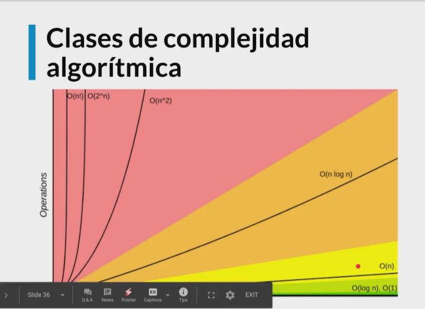
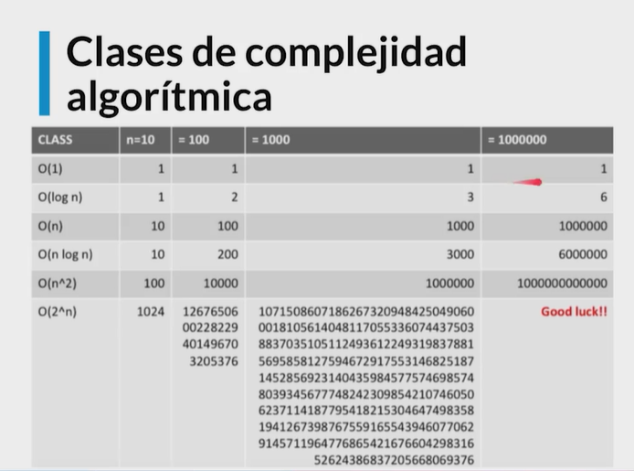

# Complejidad algoritmica: 

1 - O(1) -> Constante // Muy buen algoritmo

2 - O(n) -> Lineal // Buen algoritmo

3 - O(log n) -> Logaritmica // Muy buen algoritmo

4 - O(n log n) log lineal // Mediocre algoritmo

5 - O(n**2) Polinomial // Comienza a crecer muy rapido. Peligroso. Pero se pueden usar

6 - O(2**n) Exponencial // Muy peligroso. No sirven. Hay que desecharlos. Sirven para resolver problemas pequeños solamente. 

 

 

